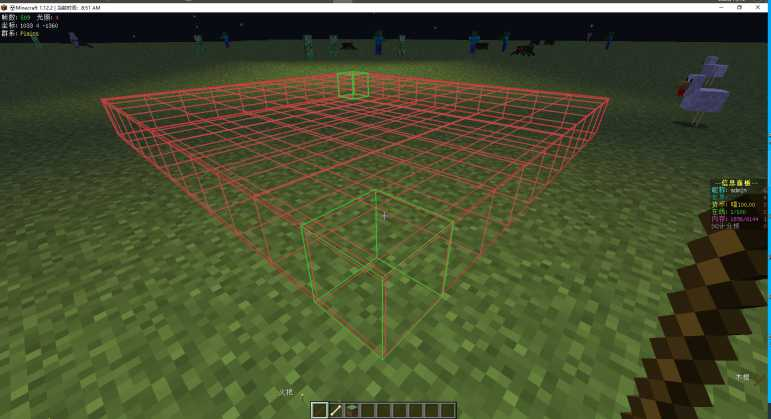
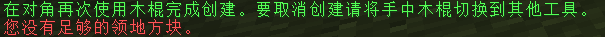

{docsify-updated}
# 新手起步

> 当前世界版本 : 1.12.2_20201123  
> 当前最新 整合包 Windows 版客户端版本为 :喵世界_V1.12.2_20201123_修订7_Win.zip  
> 当前最新 基础包(仅包含必要mod) Windows 版本客户端为:喵世界基础包_V1.12.2_20201123_修订4_Win.zip

!> 服务器目前已经关闭账号注册，请确保您拥有正版 Minecraft 账号  
因此 首次加入游戏请到下载最新[客户端](https://dl.nya.world/#/s/jRfM)   
完成后于右侧用户名填入你的账号进行登录,也可自行使用第三方启动器(需支援正版验证)  
另外提供服务器必备模组压缩包，可自行整合  
客户端版本命名格式如下: `[游戏版本]` `[服务器当前模组版本]`  `[客户端版本]`  `[客户端修订编号]`  
例如当前，游戏版本12.2.2,服务器模组版本20201109,客户端修订编号3 则客户端命名为`喵世界_V1.12.2_20201109_修订3`  

## 加入游戏
服务器地址，默认情况下根据您所选的DNS服务商会将您智能解析到离您最近的服务器:  
> play.nya.world

如果您在上海等地或距离上海较近(华东)，可以使用以下地址(阿里云上海):  
> sha.play.nya.world

如果您在广州等地或距离广州较近(华南)，可以使用以下地址(阿里云广州):  
> can.play.nya.world

如果您在香港等地或距离香港较近，可以使用香港线路(腾讯云香港):
>	hkg.play.nya.world

如果您在东京等地或距离东京较近，可以使用东京线路(Amazon Web Services Tokyo):
>	tyo.play.nya.world

如果您出现认证服务器失败，可尝试指定认证服务器:
香港:
> hk.mc.login.nya.world

如果您仍旧存在延迟过高等问题，请联系管理组提供网络ISP等信息以便排查问题

## 常用命令速查
!> 此表格仅为速查表 具体说明请参考其他相关页面  
   部分命令将会收取一定费用(游戏内货币)
### 功能
|    指令    | 用途 | 备注|
| ---------- | --------------------- | --- |
|`/vc o mainmenu`|打开服务器主菜单|整合包可使用T来快捷使用|
|`/vc o GPinfo`|领地面板
|`/yyssb toggle`|关闭计分板

### 传送
|    指令    | 用途 | 备注|
| ---------- | --------------------- | --- |
| `/spawn`   |  返回服务器默认出生点   |
| `/back`    |  返回上次传送所处的位置 |
| `/home`    |  传送回你所设定的家    | 仅家设定数量为一个或家名字设定为 home 时生效
| `/home [家的名称]` | 传送回所指定的家 | 
| `/sethome` | 设置一个名为 home 的家 | 
| `/home set [家的名称]` | 设置一个名称自定的家 | 默认家的数量上限为 3 个
| `/home list` | 列出当前所设置的家的名称
| `/home delete [家的名称]` | 删除所设定的家
| `/home limit` | 打印当前的家限额
|` /gp`| 查看领地相关命令| [圈地教程](###圈地教程)

### 经济
|    指令    | 用途 | 备注|
| ---------- | --------------------- | --- |
| `/balance`  `/bal` | 查询当前货币余额
| `/pay [玩家ID] [数额]` | 转账给指定玩家 |  
| `/um a [售价] [数量(可选)] `| 将手中物品挂到服务器商城|
|`/um` | 打开服务器商城|

### 物品
|    指令    | 用途 | 备注|
| ---------- | --------------------- | --- |
| `/hat` | 将主手中的物品作为头盔穿戴

### 服务器状态
|    指令    | 用途 | 备注|
| ---------- | --------------------- | --- |
| `/list`  | 列出当前主服务器玩家

## 服务器各类插件教程

### 领地插件
>服务器使用的领地插件为`GriefPrevention`  
设定的工具为`木棍`以及`骨头`
#### 圈地教程
首先将主手切换至`木棍`,此时左下角应有提示您当前的区块信息等:  
  
然后使用鼠标左右键以`对角线`的形式选中第一个方块:  
  
接着选中第二个方块,服务器当前设定为2D平面圈地方式，因此仅需设定对角线即可:  
  
此时便已经完成了领地设置:  
  
如果您当前领地领地方块不足届时就会出现以下提示:  
  
此时可通过打开 `T键菜单` 来进行领地方块购买售出操作

## 游戏模组
!>当前表格仅列出主要模组  
已启用的其他前置以及各类优化辅助模组等并不一定会在此表格中列出

### 已启用模组
|    模组    |    中文名   |版本 | 分类 | 教程|  
| - |  | | | |  
|Alchemistry|[炼金化学](https://www.mcmod.cn/class/1928.html)|alchemistry-1.12.2-41|科技  
|Applied Energistics 2|[应用能源2](https://www.mcmod.cn/class/260.html)|appliedenergistics2-rv6-stable-7|科技  
|Immersive Engineering|[沉浸工程](https://www.mcmod.cn/class/463.html)|ImmersiveEngineering-0.12-98|科技  
|Thermal Expansion 5 | [热力膨胀5](https://www.mcmod.cn/class/634.html) | ThermalExpansion-1.12.2-5.5.7.1-universal | 科技  
|Thermal Dynamics|[热动力学](https://www.mcmod.cn/class/480.html)|ThermalDynamics-1.12.2-2.5.6.1-universal|科技  
|Industrial Craft 2|[工业时代2](https://www.mcmod.cn/class/2.html)|industrialcraft-2-2.8.221-ex112| 科技  
|Mekanism |[通用机械](https://www.mcmod.cn/class/187.html)|Mekanism-1.12.2-9.8.3.390|科技  
|Mekanism Generators|[通用机械发电机](https://www.mcmod.cn/class/1323.html)|MekanismGenerators-1.12.2-9.8.3.390|科技  
|Mekanism Tools|[通用机械工具](https://www.mcmod.cn/class/1615.html)|MekanismTools-1.12.2-9.8.3.390|科技  
|NuclearCraft|[核电工艺](https://www.mcmod.cn/class/388.html)|NuclearCraft-2.18y-1.12.2|科技  
|Botania|[植物魔法](https://www.mcmod.cn/class/332.html)|Botania+r1.10-363|魔法  
|Mystical Agriculture|[神秘农业](https://www.mcmod.cn/class/929.html)|MysticalAgriculture-1.12.2-1.7.5|农业     
|XL Food Mod|[超多食物](https://www.mcmod.cn/class/1515.html)|XL-Food-Mod-1.12.2-1.9.2|农业  
|Avaritia|[无尽贪婪](https://www.mcmod.cn/class/505.html)|Avaritia-1.12.2-3.3.0.33-universal|实用   
|Draconic Evolution|[龙之进化](https://www.mcmod.cn/class/423.html)|Draconic-Evolution-1.12.2-2.3.27.353-universal|实用    
|Extra Utilities 2|更多实用设备2|extrautils2-1.12-1.9.9|实用    
|Tinkers' Construct 2|[匠魂2](https://www.mcmod.cn/class/683.html)|TConstruct-1.12.2-2.13.0.183|实用   
|Construct's Armory|[匠魂盔甲](https://www.mcmod.cn/class/1318.html)|conarm-1.12.2-1.2.5.4|实用   
|TAIGA (Tinkers alloying addon)|[匠魂合金附加](https://www.mcmod.cn/class/1146.html) |taiga-1.12.2-1.3.4|实用   
|Storage Drawers|[储物抽屉](https://www.mcmod.cn/class/408.html)|StorageDrawers-1.12.2-5.4.2|实用  
|The Aether|[天境](https://www.mcmod.cn/class/94.html)|aether-1.12.2-v1.5.2|冒险  
|The Twilight Forest|[暮色森林](https://www.mcmod.cn/class/61.html)|twilightforest-1.12.2-3.11.1021-universal|冒险   
|Corail's Tombstone|[Corail的墓碑](https://www.mcmod.cn/class/1985.html)|tombstone-4.0.0-1.12.2|魔法   
|Biomes O' Plenty|超多生物群系|BiomesOPlenty-1.12.2-7.0.1.2444-universal|装饰   
|MrCrayfish's Furniture Mod|[MrCrayfish的家具](https://www.mcmod.cn/class/263.html)|furniture-6.3.1-1.12.2|装饰  
### 计划中待添加模组
|    模组    |    中文名   |分类 |   
| -          |            |     |  

## 已封禁物品

|    模组    |    物品名称  |封禁原因|  
| - |  |  |  
|原版|TNT| TNT 原罪|  
|Applied Energistics 2|物质炮|玩家请求封禁，无视领地破坏  
|Industrial Craft 2 | 区块加载器|范围过大，已有相同类型范围更小工具提供|  
|Industrial Craft 2 | 工业TNT|TNT 原罪|  
|Industrial Craft 2|镭射采矿枪|玩家请求封禁,热能离心机可使用材料兑换|  
|Industrial Craft 2|OV扫描器|OV扫描器在高级采矿机上范围过大带来了领地破坏问题|
|Mekanism|黑曜石TNT|TNT 原罪|

## 世界构成
!>此页主要内容为喵世界主要服务器内各世界构成且所有世界`互通经济、背包与商店内容`  
此页面中的原版世界特指 Minecraft 原版内容所带来的世界，非原版世界主要指模组以及刻意生成其他世界

截至 2020/11/11 暂未开放玩家传送指令 相关维度仅能通过模组亦或者 `菜单` 进入

### 原版世界
#### 主世界
世界代号: `world`  
主世界是玩家出生、日常游戏、活动的区域，永不重置。    
主世界部分区域可能会对建造、砍伐、挖矿等游戏内容有所限制。  

#### The End
世界代号:`DIM1`  
一个漂浮在虚空中的黑暗维度  

#### The Nether
世界代号:`DIM-1`  
一个充满着硝烟味的地狱世界  

### 非原版世界
##### 奇思妙想
世界代号:`fantasy`   
任何脑洞大开的奇思妙想建筑皆可来此建造，另外不可对他人建筑造成破坏。  
也可拿来建造像素画，若希望在此建造，请确保不会对其他像素画产生冲突   

#### 暮色森林
世界代号:`DIM7`  
模组:The Twilight Forest 所生成的世界
一个被永恒之夜笼罩的森林世界，这个世界充满了新的生物与新的植物以及各种探险要素。  
这里曾孕育了繁荣的文明，但是你未能目睹。  
如今永久的黄昏笼罩这里，森林中仅存着一些遗迹、葱郁的树木，及奇怪的生物。  
你决心揭开暮色森林的神秘面纱，但是你很快发现，遗迹拥有了新的主人。  
并非所有森林居民都对入侵者十分友好！  

#### Aether  
世界代号:`Dim-Aether`   
模组:The Aether所生成的世界  
天境是世界之上的澄澈长空，其间散布着厚重神秘的斑斓云层，以及座座富饶雄伟、风景秀丽的浮空岛屿。撑起浮岛结构的圣石岩层中埋藏着种种神奇的魔法矿石，岛屿地表的天壤上生长着株株生机勃勃的以太植物，云岛之间的魔力孕育了各色闻所未闻的奇异生灵。如果你惊异于雄伟壮观、危机四伏的迷宫堡垒，那就去读一读Lore吧，聆听这片天空讲述它自己的故事与传奇。    

#### 资源世界  
世界代号:`ziyuan`  
仅作资源采集使用的世界，定期重置  

#### 漆黑世界  
世界代号:`11325`  
仅作资源采集使用的世界，定期重置  

### 未提供进入方法的维度  
#### 辐射废土   
世界代号:`DIM4598`  
模组: NuclearCraft: Overhauled所生成的世界  

### 已删除
~~#### 阿图姆~~ 
~~世界代号:`DIM17`  
模组:Atum 2: Return to the Sands 所生成的世界~~   
~~阿图姆主要以沙漠地形为主，环境炎热干燥，有时还会出现沙尘暴。水会像下界一样蒸发，除非你在绿洲（Oasis）生物群系。  
阿图姆全天都会刷怪，在地表十分危险。白天刷刺客、强盗、游牧人和野蛮人，晚上刷木乃伊、被遗忘者、骨头风暴和怨灵。~~
