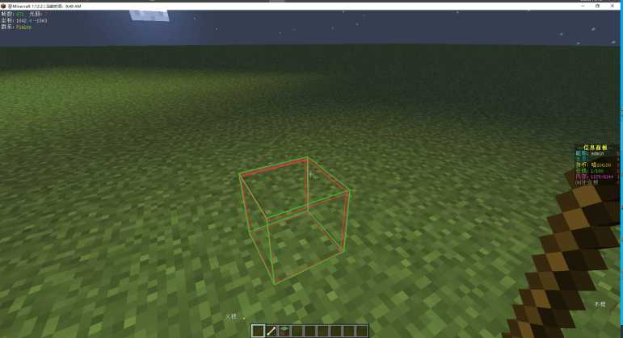
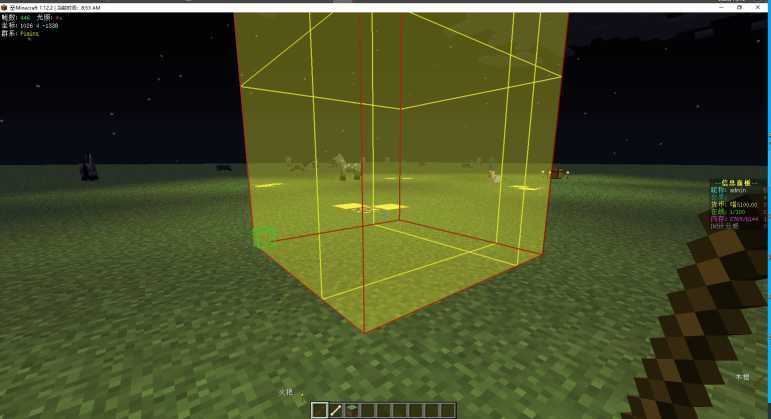

# 服务器各类插件教程

## 领地插件
>服务器使用的领地插件为`GriefPrevention`  
设定的工具为`木棍`以及`骨头`
### 圈地教程
首先将主手切换至`木棍`,此时左下角应有提示您当前的区块信息等:  
  
然后使用鼠标左右键以`对角线`的形式选中第一个方块:  
  
接着选中第二个方块,服务器当前设定为2D平面圈地方式，因此仅需设定对角线即可:  
  
此时便已经完成了领地设置:  
  
如果您当前领地领地方块不足届时就会出现以下提示:  
  
此时可通过打开 `T键菜单` 来进行领地方块购买售出操作

